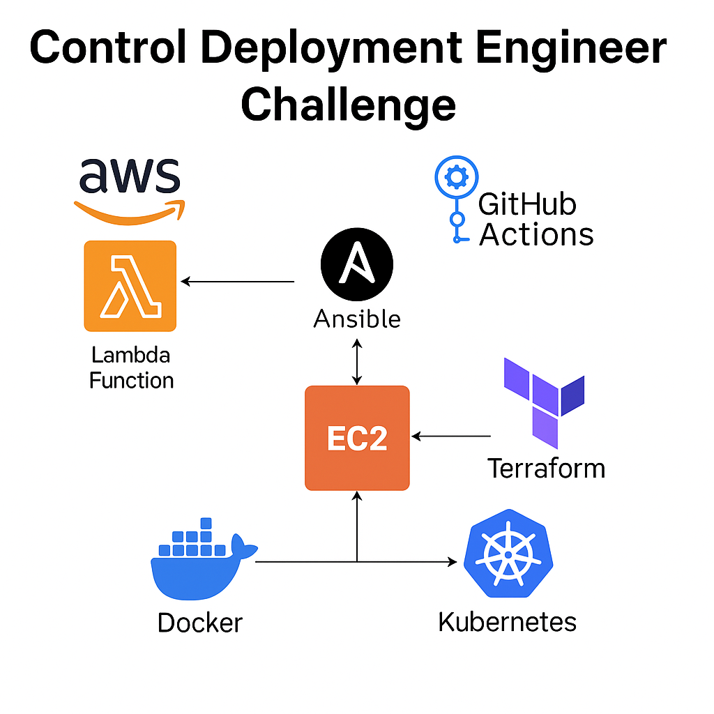

---

## 🧰 Architecture Overview



---

## 🔒 Part 1: Cybersecurity

- **threat-report.md**  
  Describes a simulated security breach scenario, its cause, impact, and mitigation.

- **incident-response-plan.md**  
  Contains an incident response strategy following NIST guidelines.

- **network-security-measures.md**  
  Documents security best practices like VPC design, firewalls, IAM, and log monitoring.

---

## 🐳 Part 2: Container Security

- **Dockerfile**  
  Minimal, secure image build using `alpine` and `USER` directive.

- **docker-security.md**  
  Docker security best practices: non-root user, multistage builds, vulnerability scanning.

- **k8s-security.yaml**  
  Secure pod spec: RBAC, resource limits, no privileged containers.

- **iaas-security.md**  
  AWS EC2 security practices including:
  - Hardened AMIs
  - Least privilege IAM
  - SSM over SSH
  - CloudWatch monitoring

---

## 🔁 Part 3: CI/CD Pipeline

### ✅ Ansible

- `ansible/deploy_web.yml`:  
  Deploys a sample Apache web server using best practices (no hardcoded hosts, modular role-like layout).

- `ansible/inventory.ini`:  
  Dynamic or static inventory for Ansible playbooks.

### ✅ Terraform

- `terraform/main.tf`:  
  Provisions AWS Lambda infrastructure using modules and input variables.

### ✅ Lambda

- `sample-lambda/index.js`:  
  A simple handler script that prints event data and confirms the CI/CD flow.

### ✅ GitHub Actions

- `.github/workflows/deploy-lambda.yml`:  
  Automates Lambda deployment using GitHub Actions. Steps include:
  - Checkout
  - Zip source
  - Upload to AWS Lambda
  - Notify success/failure

---

## 🎯 How to Run

> Prerequisites:
> - AWS CLI configured
> - Terraform installed
> - GitHub Secrets set (`AWS_ACCESS_KEY_ID`, `AWS_SECRET_ACCESS_KEY`)
> - Ansible installed with SSH access

1. **Terraform Deployment**  
   ```bash
   cd part3-cicd-pipeline/terraform
   terraform init
   terraform apply
